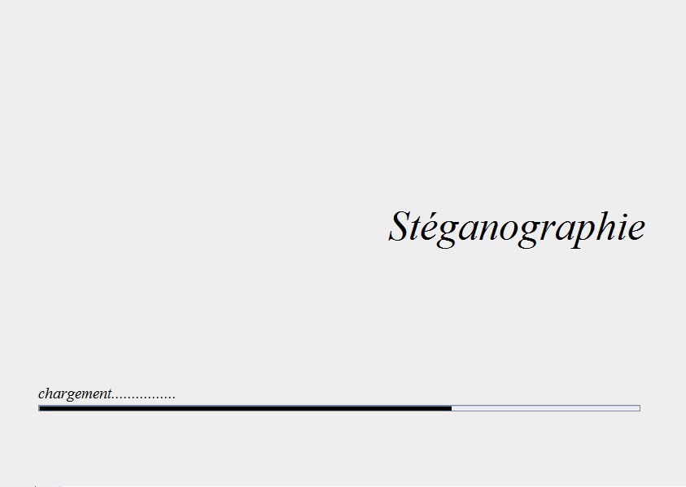
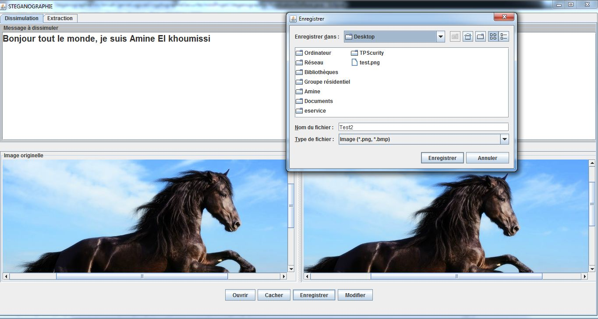
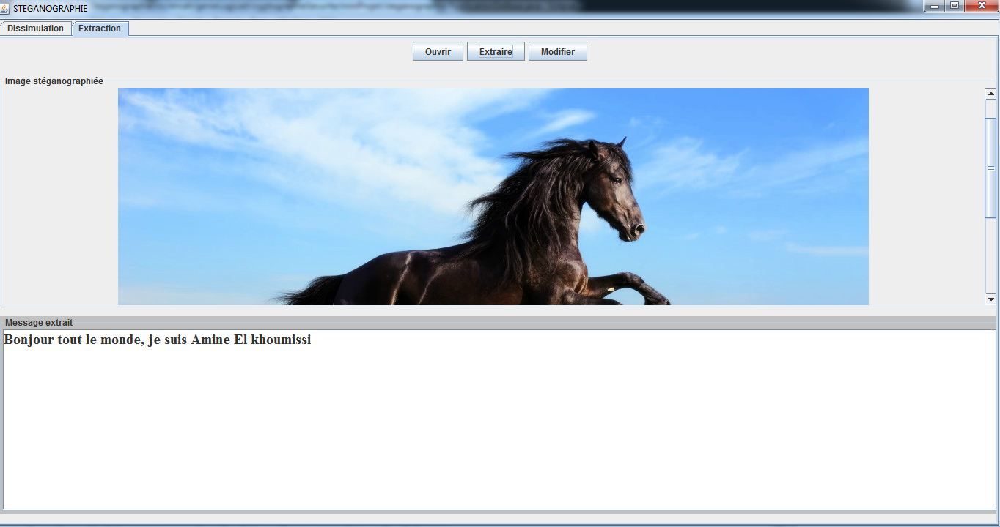

# Nom du projet:      Stéganographie

---

## Table des matières:

- [Description](#description)
- [Technologies](#technologies)
- [Installation](#installation)
- [Captures](#captures)

---

## Description:

Cette application permet de cacher un texte dans une image et de le récupérer
 tout en utilisant l'algorithme "Least Significant Bit" (Bit de Poids Faible).
 
 ---
 
 ## Technologies:

- Bibliothèque graphique Swing du langage Java

---

## Installation:
- Cloner le projet;
- Exécuter le projet;

---

## Captures:

- Page de chargement de l'application:

- Page de dissimulation d'un texte dans une image:

- Page d'extraction d'un texte d'une image:

---

- [Début de page](#table-des-matières)

